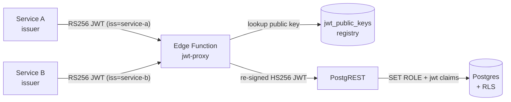

# @murich/supabase-multi-issuer-jwt

Federated multi-issuer JWT auth for Supabase. Let multiple backend services
write to a shared Supabase project with scoped, per-service permissions —
without handing out the target's `service_role` key.

[](https://jsr.io/@murich/supabase-multi-issuer-jwt)
[](https://www.npmjs.com/package/@murich/supabase-multi-issuer-jwt)
[](./LICENSE)

---

## Why this exists

A Supabase project that has to accept writes from several independent backend
services typically ends up in one of two awkward places.

The first option is to hand out the `service_role` key. That key bypasses Row
Level Security and grants unrestricted access to every table in the project.
Sharing it across services means any compromise — leaked CI variable, exposed
log line, malicious dependency in one service — yields full database access.
There is no scoping, no per-issuer audit trail, and no clean way to revoke one
consumer without rotating the secret for everyone.

The second option is to give every service the `anon` key and write permissive
RLS policies that allow the writes those services need. This works for one or
two well-behaved consumers, but it conflates the public-website client with
internal services, leaks the same key everywhere, and forces RLS policies to
identify services by guessable claims they can forge.

This library establishes a middle ground. Each writer service holds its own
RS256 keypair. The target Supabase project keeps a registry of trusted public
keys (`jwt_public_keys`) — one row per issuer. A small Edge Function in front of
PostgREST verifies inbound JWTs against the registry and re-signs them with the
target's native HS256 secret so stock PostgREST can validate them. RLS policies
then gate writes by `auth.jwt() ->> 'iss'` and `auth.jwt() ->> 'role'`, so each
issuer is restricted to exactly the tables and operations its policies allow.

The net effect: the `service_role` key never leaves the target project; revoking
a writer is a single `UPDATE jwt_public_keys SET is_active = false`; and the
trust model is asymmetric — issuers do not need to know any of the target's
secrets.

---

## Architecture



The target Supabase project maintains a `jwt_public_keys` table. Each issuing
service has one row containing its public key. The proxy Edge Function reads
from that table, verifies the inbound signature, then re-signs the same claim
set as HS256 using the target's native JWT secret. PostgREST sees a normal
Supabase JWT and applies RLS as usual.

---

## Security model: per-target keys + short-lived tokens

The strongest replay protection available without shared state comes from combining two conventions.

**One keypair per consumer–target pair.** Each issuing service generates a separate keypair for each Supabase project it writes to. Service A writing to both `target-prod` and `target-staging` holds two private keys and registers the matching public key on each target independently.

This cryptographically binds every JWT to a specific target. A token signed with `service-a-target-prod.key` cannot be replayed against `target-staging` because `target-staging`'s `jwt_public_keys` table only holds `service-a-target-staging.pub` — signature verification fails before any claim is read.

**Short-lived per-call tokens.** Sign a fresh JWT immediately before each HTTP request with a short lifetime. The library default is `"60s"`. Together with per-target key binding:

| Threat | Outcome |
|--------|---------|
| Cross-target replay | **Impossible** — wrong key, signature fails |
| Within-target replay | Bounded to **≤ 60 s** — too short to exploit in practice |

This eliminates the need for `jti` deduplication, which would require a shared consistent store (Redis, Postgres) reachable by every Edge Function instance. Per-target keys + 60 s expiry gives equivalent practical security with zero operational overhead.

**Recommended key naming:**

```
keys/
  service-a-prod-abc123.key    ← private, injected into Service A's secrets
  service-a-prod-abc123.pub    ← registered on prod-abc123's jwt_public_keys
  service-a-staging-xyz789.key
  service-a-staging-xyz789.pub
```

**Setup for two targets:**

```sh
# Production target
npx supabase-multi-issuer-jwt keygen \
  --issuer service-a \
  --target https://prod-abc123.supabase.co \
  --out ./keys

npx supabase-multi-issuer-jwt register \
  --target https://prod-abc123.supabase.co \
  --service-role "$PROD_SERVICE_ROLE" \
  --issuer service-a \
  --public-key ./keys/service-a-prod-abc123.pub

# Staging target — different keypair, same issuer name
npx supabase-multi-issuer-jwt keygen \
  --issuer service-a \
  --target https://staging-xyz789.supabase.co \
  --out ./keys

npx supabase-multi-issuer-jwt register \
  --target https://staging-xyz789.supabase.co \
  --service-role "$STAGING_SERVICE_ROLE" \
  --issuer service-a \
  --public-key ./keys/service-a-staging-xyz789.pub
```

**At call time:**

```ts
// Mint fresh before every request — defaults to 60 s.
const token = await signMultiIssuerJwt({
  privateKey: PROD_PRIVATE_KEY,   // target-specific key
  issuer: "service-a",
  claims: { sub: "worker-1", role: "widgets_writer" },
});

await fetch("https://prod-abc123.supabase.co/functions/v1/rest/widgets", {
  method: "POST",
  headers: { Authorization: `Bearer ${token}`, "Content-Type": "application/json" },
  body: JSON.stringify(payload),
});
```

---

## Quickstart

### 1. Install

Deno / JSR:

```sh
deno add jsr:@murich/supabase-multi-issuer-jwt
```

Node / npm:

```sh
npm install @murich/supabase-multi-issuer-jwt
```

Bun:

```sh
bunx jsr add @murich/supabase-multi-issuer-jwt
```

### 2. Apply migrations to the target Supabase project

Copy the SQL files from this package's `migrations/` directory into your
project's `supabase/migrations/` and apply them:

```sh
cp node_modules/@murich/supabase-multi-issuer-jwt/migrations/*.sql supabase/migrations/
supabase db push
```

This creates the `jwt_public_keys` registry table and the
`auth.is_issuer(text)`, `auth.has_role(text)`, and `auth.issuer()` helper
functions used by RLS policies.

### 3. Deploy the proxy Edge Function

Copy the `templates/jwt-proxy/` directory into `supabase/functions/rest/` on the
target project and deploy:

```sh
cp -r node_modules/@murich/supabase-multi-issuer-jwt/templates/jwt-proxy supabase/functions/rest
supabase functions deploy rest --no-verify-jwt
```

`--no-verify-jwt` is required because the proxy handles its own verification
against the registry — the platform-level JWT check would reject the inbound
RS256 tokens.

### 4. Generate a keypair for an issuing service

```sh
npx supabase-multi-issuer-jwt keygen \
  --issuer my-service \
  --target https://your-project.supabase.co \
  --out ./keys
```

Passing `--target` names the files after both the issuer and the target
(`my-service-your-project.key` / `.pub`), making it unambiguous which key
belongs to which deployment when you have multiple targets. Store the private key
as a secret in the issuing service; the public key is registered on the target.

### 5. Register the public key on the target

```sh
npx supabase-multi-issuer-jwt register \
  --target https://your-project.supabase.co \
  --service-role "$SUPABASE_SERVICE_ROLE_KEY" \
  --issuer my-service \
  --public-key ./keys/my-service.pub
```

The service-role key is used **only** for this one-time registration call. It
does not need to be held by the issuer at runtime.

### 6. Mint a JWT and write

From the issuing service:

```ts
import { signMultiIssuerJwt } from "@murich/supabase-multi-issuer-jwt";

const privateKey = Deno.readTextFileSync("./keys/my-service.key");

const token = await signMultiIssuerJwt({
  privateKey,
  issuer: "my-service",
  claims: {
    sub: "depot-42",
    role: "widgets_writer",
  },
  expiresIn: "60s", // default — mint fresh before each call
});

const res = await fetch(
  "https://your-project.supabase.co/functions/v1/rest/widgets",
  {
    method: "POST",
    headers: {
      Authorization: `Bearer ${token}`,
      "Content-Type": "application/json",
      Prefer: "return=representation",
    },
    body: JSON.stringify({ name: "Widget A" }),
  },
);

console.log(await res.json());
```

---

## Writing RLS policies

RLS policies use the helper functions installed by migration
`002_auth_helpers.sql`. The functions read claims from `auth.jwt()` and return
typed booleans usable in policy expressions.

```sql
-- Anyone holding a widgets_writer role token can INSERT, and the
-- inserted row will record their issuer as the owner.
CREATE POLICY widgets_insert ON public.widgets
  FOR INSERT TO authenticated
  WITH CHECK (
    auth.has_role('widgets_writer')
    AND owner_issuer = auth.issuer()
  );

-- Only the issuer that owns the row can update or delete it.
CREATE POLICY widgets_update ON public.widgets
  FOR UPDATE TO authenticated
  USING (auth.is_issuer(owner_issuer));

CREATE POLICY widgets_delete ON public.widgets
  FOR DELETE TO authenticated
  USING (auth.is_issuer(owner_issuer));
```

`auth.is_issuer(text)` returns `true` when the JWT's `iss` claim equals the
argument. `auth.has_role(text)` checks the `role` claim. `auth.issuer()` returns
the `iss` claim as text.

---

## API reference

| Export                                                                            | Purpose                                                                                                                                                  |
| --------------------------------------------------------------------------------- | -------------------------------------------------------------------------------------------------------------------------------------------------------- |
| `signMultiIssuerJwt(opts: SignOptions): Promise<string>`                          | Mint an RS256 JWT from an issuer's private key.                                                                                                          |
| `verifyMultiIssuerJwt(token: string, opts: VerifyOptions): Promise<VerifyResult>` | Verify an inbound JWT against the public-key registry. Throws `JwtVerificationError` on any failure.                                                     |
| `createJwtSwapProxy(opts: ProxyOptions): (req: Request) => Promise<Response>`     | Factory that returns a `fetch`-style handler verifying RS256 JWTs and forwarding HS256-signed requests to PostgREST. Used by the Edge Function template. |
| `registerPublicKey(opts: RegisterOptions): Promise<PublicKeyRow>`                 | Insert or upsert a public key into the `jwt_public_keys` registry.                                                                                       |
| `deactivateIssuer(supabaseUrl, serviceRoleKey, issuer): Promise<void>`            | Set `is_active = false` on a registry row. Existing JWTs from that issuer will be rejected on next verify.                                               |
| `listPublicKeys(supabaseUrl, serviceRoleKey): Promise<PublicKeyRow[]>`            | List all registered keys.                                                                                                                                |
| `JwtVerificationError`                                                            | Discriminated error class with a `reason` field for verification failures.                                                                               |

Types `Algorithm`, `MultiIssuerJwtClaims`, `PublicKeyRow`, `SignOptions`,
`VerifyOptions`, `VerifyResult`, `ProxyOptions`, and `RegisterOptions` are
exported from the package root. See [`src/types.ts`](./src/types.ts) for the
full type definitions.

CLI commands installed by the `bin` entry:

| Command                                | Purpose                                             |
| -------------------------------------- | --------------------------------------------------- |
| `supabase-multi-issuer-jwt keygen`     | Generate a new RS256 keypair.                       |
| `supabase-multi-issuer-jwt register`   | Register a public key on a target Supabase project. |
| `supabase-multi-issuer-jwt mint`       | Mint a JWT for local testing.                       |
| `supabase-multi-issuer-jwt list`       | List registered issuers on a target.                |
| `supabase-multi-issuer-jwt deactivate` | Mark an issuer as inactive.                         |

---

## Key rotation

See [`docs/key-rotation.md`](./docs/key-rotation.md) for the full procedure. The
short version: register the new public key under a temporary issuer name, switch
the issuing service to the new key, then deactivate the old issuer once
in-flight tokens expire.

## Threat model

See [`docs/threat-model.md`](./docs/threat-model.md) for the threats considered
and their mitigations. Key points: a stolen private key is bounded by
`is_active=false` revocation; the library does not change the blast radius of a
compromised target `service_role` or HS256 secret; clock skew is tolerated via
`clockToleranceSec`.

## Architecture deep-dive and alternatives

[`docs/architecture.md`](./docs/architecture.md) covers the full request
lifecycle and design rationale. [`docs/alternatives.md`](./docs/alternatives.md)
compares this approach with shared service-role keys, anon-only RLS, Supabase
Auth users for services, custom PostgREST middleware, and per-service Supabase
projects.

---

## Contributing

Issues and pull requests are welcome. Before submitting a PR:

```sh
deno task fmt:check
deno task lint
deno task test
```

The full integration test suite under `examples/` requires Docker Compose; see
[`examples/README.md`](./examples/README.md).

## License

MIT. See [`LICENSE`](./LICENSE).
